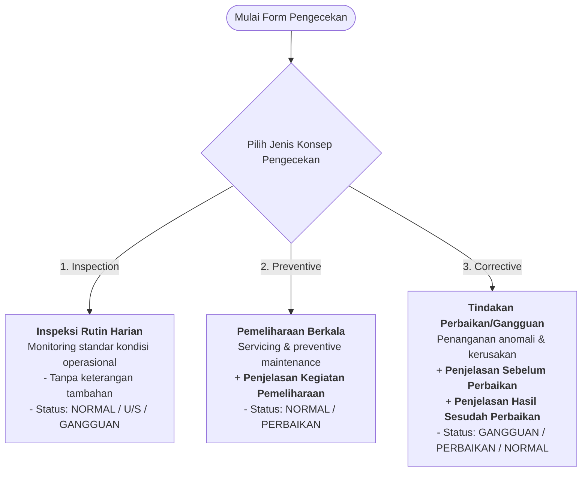

# Spesifikasi Data Input & Konsep Pengecekan JATSC

**Versi:** 1.0 | **Tanggal:** 26 Agustus 2026 | **Status:** Draft Resmi

Dokumen ini mendefinisikan standar lengkap untuk struktur data input, berdasarkan 4 sheet logsheet operasional JATSC, konfigurasi sistem **2 Shift Kerja** (Morning & Night), serta penerapan **3 Konsep Pengecekan** (*Inspection*, *Preventive*, dan *Corrective*). Spesifikasi ini menjadi rujukan baku untuk pengembangan sistem database, desain form UI, validasi backend, dan pembuatan laporan (Excel/PDF/CSV).

---

## 1. Konfigurasi Shift Kerja

Operasional monitoring dan sistem logsheet JATSC menggunakan model **2 Shift Kerja** yang berjalan sepanjang waktu (24 jam):

| Kode Shift | Nama Shift | Rentang Waktu (WIB) | Durasi | Format Kode Sheet | Contoh |
| :--- | :--- | :--- | :--- | :--- | :--- |
| **M** | **Morning** (Pagi) | 07:00 – 19:00 | 12 jam | `DD/MM/YYYY M` | `26/08/2026 M` |
| **N** | **Night** (Malam) | 19:00 – 07:00 (+1 hari) | 12 jam | `DD/MM/YYYY N` | `26/08/2026 N` |

**Catatan Penting:**
- Setiap sheet logsheet **HARUS** memiliki Nama Sheet yang unik berdasarkan tanggal dan kode shift.
- Identifikasi sheet menggunakan format `DD/MM/YYYY [M|N]` untuk kemudahan navigasi dan pencarian data historis.
- Pergantian shift terjadi pada pukul 07:00 dan 19:00 WIB setiap harinya.
- Setiap shift berdurasi **12 jam** dengan total coverage 24 jam penuh per hari.

---

## 2. Konsep & Jenis Kegiatan Pengecekan

Sebelum melakukan input parameter teknis peralatan, teknisi **WAJIB memilih Jenis Konsep Pengecekan terlebih dahulu**. Pilihan ini menentukan:
- Kolom/field tambahan yang harus diisi
- Validasi data yang berlaku
- Kriteria status operasional yang dapat dipilih
- Persyaratan laporan yang harus dilengkapi

**Diagram Alur Pemilihan Konsep:**



### Detail Aturan Input Berdasarkan Konsep:

#### 1. **INSPECTION** (Inspeksi Harian / Rutin Operasional)

| Atribut | Deskripsi |
| :--- | :--- |
| **Tujuan** | Monitoring rutin kondisi operasional sistem dan pencatatan parameter harian untuk analisis tren performa. |
| **Frekuensi** | Minimal 2x per hari (setiap pergantian shift) atau sesuai prosedur operasional. |
| **Status yang Umum** | `NORMAL`, `U/S` (Unserviceable), `GANGGUAN` (dengan rencana perbaikan) |
| **Field Input** | Semua parameter standar logsheet (Tegangan, Arus, Suhu, COS φ, KWH, Status, Flag status, Waktu Update). |
| **Kolom Tambahan** | **Tidak ada** — catatan/keterangan bersifat opsional atau minimal (hanya jika terdapat anomali kecil). |
| **Validasi Form** | ✓ Cek threshold tegangan, arus, dan suhu terhadap batas aman operasional.<br/>✓ Nilai harus masuk akal (tidak 0 atau negatif kecuali jika dimungkinkan). |
| **Contoh Kasus** | Pembacaan parameter rutin tank chiller atau MDS pada shift Pagi tanpa temuan anomali. |

#### 2. **PREVENTIVE** (Pemeliharaan Berkala / Perawatan Terencana)

| Atribut | Deskripsi |
| :--- | :--- |
| **Tujuan** | Kegiatan pemeliharaan terjadwal/berkala untuk mencegah degradasi performa dan memperpanjang usia peralatan. |
| **Frekuensi** | Sesuai jadwal PM (Preventive Maintenance) — misalnya: harian, mingguan, bulanan, atau triwulanan per equipment. |
| **Status yang Umum** | `NORMAL` (setelah maintenance), `PERBAIKAN` (sedang dalam proses maintenance) |
| **Field Input** | Semua parameter standar + **Penjelasan Kegiatan Pemeliharaan** (field keterangan wajib). |
| **Kolom Wajib Diisi** | `penjelasan_pemeliharaan` (**Penjelasan Kegiatan Pemeliharaan**) — Uraian detail aktivitas yang dilakukan, misalnya:<ul><li>Pembersihan modul inverter & rectifier</li><li>Pengencangan koneksi terminal & kabel</li><li>Kalibrasi sensor suhu/tegangan</li><li>Pengujian fungsional battery charger</li><li>Penggantian filter AC/DC input</li><li>Pemeriksaan kondisi housing & cooling fan</li></ul> |
| **Validasi Form** | ✓ Penjelasan minimal 10 karakter & maksimal 500 karakter.<br/>✓ Harus deskriptif & mencakup tindakan nyata yang dilakukan. |
| **Contoh Kasus** | Pemeliharaan berkala UPS 200 KVA: cleaning filter input, testing battery load, checking bypass stability. |

#### 3. **CORRECTIVE** (Tindakan Perbaikan / Penanganan Gangguan)

| Atribut | Deskripsi |
| :--- | :--- |
| **Tujuan** | Penanganan gangguan/anomali atau tindak lanjut atas status `GANGGUAN` atau `U/S` untuk mengembalikan sistem ke kondisi operasional. |
| **Frekuensi** | Ad-hoc — saat ditemukan gangguan atau kegagalan sistem. |
| **Status yang Umum** | `GANGGUAN` (saat ditemukan masalah), `PERBAIKAN` (sedang dalam proses perbaikan), `NORMAL` (setelah tuntas & terverifikasi) |
| **Field Input** | Semua parameter standar + **2 field keterangan wajib** (lihat di bawah). |
| **Kolom Wajib Diisi** | <ul><li>`penjelasan_sebelum` (**Penjelasan Perbaikan Sebelum**) — Deskripsi gangguan/kerusakan yang ditemukan, gejala kegagalan, nilai parameter anomali sebelum perbaikan, serta tindakan/langkah perbaikan yang dilakukan. Contoh: "Tegangan output inverter 180V (threshold 220V±10%). Ditemukan kapasitor buncit pada modul power. Diganti dengan tipe pengganti original."</li><li>`penjelasan_sesudah` (**Penjelasan Hasil Sesudah**) — Kondisi pasca perbaikan, hasil pengujian ulang/commissioning, nilai parameter yang telah dinormalisasi, dan status kesiapan operasional peralatan. Contoh: "Setelah penggantian kapasitor, output inverter stabil 220V. Load test 80% lancar, noise berkurang. Sistem siap operasional kembali."</li></ul> |
| **Validasi Form** | ✓ Kedua field penjelasan WAJIB diisi sebelum submit laporan (tidak boleh kosong).<br/>✓ Masing-masing minimal 20 karakter, maksimal 1000 karakter.<br/>✓ Harus detail & terukur (bukan sekedar "diperbaiki"). |
| **Contoh Kasus** | Gangguan STS tidak switching ke backup pada saat mati listrik → ditemukan masalah pada sensor tegangan → diganti modul sensor → ditest & verified. |

---

## 3. Spesifikasi Data Input (4 Logsheet JATSC)

### 3.1. Pengecekan Harian Beban Listrik Tower JATSC

*Sumber: Screenshot 1 - Pengecekan Harian Beban Listrik Tower JATSC*

#### Daftar Equipment:
`P713`, `T705A`, `CHILLER 1`, `CHILLER 2`, `CHILLER 3`, `MDS T7 LCA`, `MDS T7 LCB`, `MDS P7 LCA`, `MDS P7 LCB`, `TRAFO T-7A`, `TRAFO T-7B`, `TRAFO P-7A`, `TRAFO P-7B`.

#### Struktur Kolom:
| No | Nama Kolom | Tipe Data | Keterangan / Satuan |
| :--- | :--- | :--- | :--- |
| 1 | `Nama Sheet` | String | `DD/MM/YYYY [M/N]` (contoh: `26/08/2026 M`) |
| 2 | `Tanggal` | Date | Format `DD/MM/YYYY` |
| 3 | `Shift` | Enum | `Morning` / `Night` |
| 4 | `Lokasi` | String | `JATSC` |
| 5 | `Equipment` | String | Nama peralatan (lihat daftar equipment) |
| 6 | `Jenis Konsep` | Enum | `Inspection` / `Preventive` / `Corrective` |
| 7 | `COS` | Decimal / Float | Cos $\phi$ (Power Factor) |
| 8 | `Tegangan` | String / Float | Tegangan (V) / `220.00`, `220/380` |
| 9 | `Arus R` | Decimal / Float | Arus Phase R (Ampere) |
| 10 | `Arus S` | Decimal / Float | Arus Phase S (Ampere) |
| 11 | `Arus T` | Decimal / Float | Arus Phase T (Ampere) |
| 12 | `KWH` | BigInt / Float | Stand Meter KWH |
| 13 | `Suhu` | Decimal / Float | Suhu (°C) |
| 14 | `Status` | Enum | `NORMAL` / `U/S` / `GANGGUAN` / `PERBAIKAN` |
| 15 | `Normal` | Integer (0/1) | Flag Status Normal |
| 16 | `U/S` | Integer (0/1) | Flag Status Unserviceable |
| 17 | `Gangguan` | Integer (0/1) | Flag Status Gangguan |
| 18 | `Perbaikan` | Integer (0/1) | Flag Status Sedang Perbaikan |
| 19 | `% Normal` | Percentage | $\frac{\text{Total Normal}}{\text{Total Pengecekan}} \times 100\%$ |
| 20 | `% Gangguan` | Percentage | $\frac{\text{Total Gangguan}}{\text{Total Pengecekan}} \times 100\%$ |
| 21 | `% Perbaikan` | Percentage | $\frac{\text{Total Perbaikan}}{\text{Total Pengecekan}} \times 100\%$ |
| 22 | `Penjelasan Pemeliharaan` | Text | *Wajib jika Jenis Konsep = Preventive* |
| 23 | `Penjelasan Perbaikan Sebelum` | Text | *Wajib jika Jenis Konsep = Corrective* |
| 24 | `Penjelasan Hasil Sesudah` | Text | *Wajib jika Jenis Konsep = Corrective* |
| 25 | `Waktu Update` | Timestamp | Format `DD/MM/YYYY HH:mm:ss` |

---

### 3.2. Pengecekan Harian STS (Static Transfer Switch) Tower JATSC

*Sumber: Screenshot 2 - Pengecekan Harian STS Tower JATSC*

#### Daftar Equipment:
`ESS`, `AMSC`, `MER`, `PROCESSING ROOM`, `OPS ROOM 1`, `MDS`, `OPS ROOM 2`, `BILLING SYSTEM`, `TER`.

#### Struktur Kolom:
| No | Nama Kolom | Tipe Data | Keterangan / Satuan |
| :--- | :--- | :--- | :--- |
| 1 | `Nama Sheet` | String | `DD/MM/YYYY [P/M]` |
| 2 | `Tanggal` | Date | Format `DD/MM/YYYY` |
| 3 | `Shift` | Enum | `Morning` / `Night` |
| 4 | `Lokasi` | String | `JATSC` |
| 5 | `Equipment` | String | Nama unit STS / Ruangan |
| 6 | `Jenis Konsep` | Enum | `Inspection` / `Preventive` / `Corrective` |
| 7 | `Status` | Enum | `NORMAL` / `U/S` / `GANGGUAN` / `PERBAIKAN` |
| 8 | `TR (V)` | Decimal | Tegangan Phase R - N / Line (Volt) |
| 9 | `TS (V)` | Decimal | Tegangan Phase S - N / Line (Volt) |
| 10 | `TT (V)` | Decimal | Tegangan Phase T - N / Line (Volt) |
| 11 | `AR (A)` | Decimal | Arus Phase R (Ampere) |
| 12 | `AS (A)` | Decimal | Arus Phase S (Ampere) |
| 13 | `AT (A)` | Decimal | Arus Phase T (Ampere) |
| 14 | `Suhu (°C)` | Decimal | Suhu operasional (°C) |
| 15 | `Frekuensi (Hz)` | Decimal | Frekuensi listrik (Hz, misal: 50.00) |
| 16 | `ON` | Integer (0/1) | Status Switch ON |
| 17 | `STANDBY` | Integer (0/1) | Status Switch Standby |
| 18 | `OFF` | Integer (0/1) | Status Switch OFF |
| 19 | `Normal` | Integer (0/1) | Flag Normal (1/0) |
| 20 | `U/S` | Integer (0/1) | Flag Unserviceable (1/0) |
| 21 | `Gangguan` | Integer (0/1) | Flag Gangguan (1/0) |
| 22 | `Perbaikan` | Integer (0/1) | Flag Perbaikan (1/0) |
| 23 | `% Normal` | Percentage | Persentase Status Normal |
| 24 | `% Gangguan` | Percentage | Persentase Gangguan |
| 25 | `% Perbaikan` | Percentage | Persentase Perbaikan |
| 26 | `Penjelasan Pemeliharaan` | Text | *Wajib jika Jenis Konsep = Preventive* |
| 27 | `Penjelasan Perbaikan Sebelum` | Text | *Wajib jika Jenis Konsep = Corrective* |
| 28 | `Penjelasan Hasil Sesudah` | Text | *Wajib jika Jenis Konsep = Corrective* |
| 29 | `Waktu Update` | Timestamp | Format `DD/MM/YYYY HH:mm:ss` |

---

### 3.3. Pengecekan Harian UPS 200 KVA & 20 KVA JATSC

*Sumber: Screenshot 3 - Pengecekan Harian UPS 200 KVA & 20 KVA JATSC*

#### Daftar Equipment:
`UPS 1 200 KVA`, `UPS 2 200 KVA`, `PDB 200 KVA 1`, `PDB 200 KVA 2`, `UPS 20 KVA`, `PDB 20 KVA`, dsb.

#### Struktur Kolom:
| No | Nama Kolom | Tipe Data | Keterangan / Satuan |
| :--- | :--- | :--- | :--- |
| 1 | `Nama Sheet` | String | `DD/MM/YYYY [P/M]` |
| 2 | `Tanggal` | Date | Format `DD/MM/YYYY` |
| 3 | `Shift` | Enum | `Morning` / `Night` |
| 4 | `Lokasi` | String | `JATSC` |
| 5 | `Equipment` | String | Nama unit UPS & PDB |
| 6 | `Jenis Konsep` | Enum | `Inspection` / `Preventive` / `Corrective` |
| 7 | `Status` | Enum | `NORMAL` / `U/S` / `GANGGUAN` / `PERBAIKAN` |
| 8 | `Rectifier I-in (A)` | Decimal / Text | Arus Input Rectifier R/S/T (Ampere) |
| 9 | `Rectifier V-in (V)` | Decimal / Text | Tegangan Input Rectifier R/S/T (Volt) |
| 10 | `Arus Rectifier` | Decimal | Arus Rectifier Total / DC |
| 11 | `Inverter V-out (V)`| Decimal / Text | Tegangan Output Inverter (Volt) |
| 12 | `Inverter I-out (A)`| Decimal / Text | Arus Output Inverter (Ampere) |
| 13 | `Arus Inverter` | Decimal | Total Arus Inverter |
| 14 | `Tegangan By-pass` | Decimal | Tegangan Bypass (Volt) |
| 15 | `Temp Power` | Decimal | Suhu Modul Power (°C) |
| 16 | `Temp Room` | Decimal | Suhu Ruangan UPS (°C) |
| 17 | `Temp Battery` | Decimal | Suhu Ruang / Modul Baterai (°C) |
| 18 | `Floating Voltage` | Decimal | Tegangan Float Charger Baterai (VDC) |
| 19 | `Arus Battery` | Decimal | Arus Charge/Discharge Baterai (A) |
| 20 | `Kapasitas Battery`| Percentage/Text | Indikator Kapasitas Baterai (%) |
| 21 | `Normal` | Integer (0/1) | Flag Normal |
| 22 | `U/S` | Integer (0/1) | Flag Unserviceable |
| 23 | `Gangguan` | Integer (0/1) | Flag Gangguan |
| 24 | `Perbaikan` | Integer (0/1) | Flag Perbaikan |
| 25 | `% Normal` | Percentage | Persentase Status Normal |
| 26 | `% Gangguan` | Percentage | Persentase Gangguan |
| 27 | `% Perbaikan` | Percentage | Persentase Perbaikan |
| 28 | `Penjelasan Pemeliharaan` | Text | *Wajib jika Jenis Konsep = Preventive* |
| 29 | `Penjelasan Perbaikan Sebelum` | Text | *Wajib jika Jenis Konsep = Corrective* |
| 30 | `Penjelasan Hasil Sesudah` | Text | *Wajib jika Jenis Konsep = Corrective* |
| 31 | `Waktu Update` | Timestamp | Format `DD/MM/YYYY HH:mm:ss` |

---

### 3.4. Pengecekan Harian MDS (Main Distribution Switchboard) JATSC

*Sumber: Screenshot 4 - PENGECEKAN HARIAN MDS JATSC*

#### Daftar Equipment:
`MDS`, `MDS T7 LCA`, `MDS T7 LCB`, `MDS P7 LCA`, `MDS P7 LCB`, dsb.

#### Struktur Kolom:
| No | Nama Kolom | Tipe Data | Keterangan / Satuan |
| :--- | :--- | :--- | :--- |
| 1 | `Nama Sheet` | String | `DD/MM/YYYY [P/M]` |
| 2 | `Tanggal` | Date | Format `DD/MM/YYYY` |
| 3 | `Shift` | Enum | `Morning` / `Night` |
| 4 | `Lokasi` | String | `JATSC` |
| 5 | `Equipment` | String | Unit MDS / Panel |
| 6 | `Jenis Konsep` | Enum | `Inspection` / `Preventive` / `Corrective` |
| 7 | `Status` | Enum | `NORMAL` / `U/S` / `GANGGUAN` / `PERBAIKAN` |
| 8 | `TR (V)` | Decimal | Tegangan Phase R (Volt) |
| 9 | `TS (V)` | Decimal | Tegangan Phase S (Volt) |
| 10 | `TT (V)` | Decimal | Tegangan Phase T (Volt) |
| 11 | `AR (A)` | Decimal | Arus Phase R (Ampere) |
| 12 | `AS (A)` | Decimal | Arus Phase S (Ampere) |
| 13 | `AT (A)` | Decimal | Arus Phase T (Ampere) |
| 14 | `SR (°C)` | Decimal | Suhu Busbar / Kabel Phase R (°C) |
| 15 | `SS (°C)` | Decimal | Suhu Busbar / Kabel Phase S (°C) |
| 16 | `ST (°C)` | Decimal | Suhu Busbar / Kabel Phase T (°C) |
| 17 | `ON` | Integer (0/1) | Status Switch ON |
| 18 | `STANDBY` | Integer (0/1) | Status Switch Standby |
| 19 | `OFF` | Integer (0/1) | Status Switch OFF |
| 20 | `Normal` | Integer (0/1) | Flag Normal (1/0) |
| 21 | `U/S` | Integer (0/1) | Flag Unserviceable (1/0) |
| 22 | `Gangguan` | Integer (0/1) | Flag Gangguan (1/0) |
| 23 | `Perbaikan` | Integer (0/1) | Flag Perbaikan (1/0) |
| 24 | `% Normal` | Percentage | Persentase Normal |
| 25 | `% Gangguan` | Percentage | Persentase Gangguan |
| 26 | `% Perbaikan` | Percentage | Persentase Perbaikan |
| 27 | `Penjelasan Pemeliharaan` | Text | *Wajib jika Jenis Konsep = Preventive* |
| 28 | `Penjelasan Perbaikan Sebelum` | Text | *Wajib jika Jenis Konsep = Corrective* |
| 29 | `Penjelasan Hasil Sesudah` | Text | *Wajib jika Jenis Konsep = Corrective* |
| 30 | `Waktu Update` | Timestamp | Format `DD/MM/YYYY HH:mm:ss` |

---

## 4. Skema Database Relasional (SQLite / PostgreSQL)

Struktur database dirancang untuk mendukung **cascading validation**, **conditional required fields**, dan **audit trail** penuh:

### 4.1 Tabel Master: Sesi Pengecekan Harian

```sql
-- Menyimpan informasi session/shift pengecekan
CREATE TABLE daily_check_sessions (
    id INTEGER PRIMARY KEY AUTOINCREMENT,
    
    -- Identifikasi Session
    sheet_name VARCHAR(50) NOT NULL UNIQUE, -- Format: DD/MM/YYYY [M|N], e.g. '26/08/2026 M'
    check_date DATE NOT NULL,               -- Tanggal pengecekan
    shift VARCHAR(10) NOT NULL CHECK(shift IN ('Morning', 'Night')),
    location VARCHAR(50) DEFAULT 'JATSC',
    
    -- Kategori Logsheet (4 jenis)
    category VARCHAR(50) NOT NULL CHECK(category IN ('Beban Listrik', 'STS', 'UPS', 'MDS')),
    
    -- Metadata & Audit
    created_by VARCHAR(100),                -- Nama teknisi pembuat session
    technician_notes TEXT,                  -- Catatan umum dari teknisi
    created_at TIMESTAMP DEFAULT CURRENT_TIMESTAMP,
    updated_at TIMESTAMP DEFAULT CURRENT_TIMESTAMP,
    
    -- Constraint
    UNIQUE(check_date, shift, category)
);
```

### 4.2 Tabel Detail: Pembacaan Parameter & Keterangan Kegiatan

```sql
-- Menyimpan setiap record pembacaan equipment & tindakan
CREATE TABLE equipment_readings (
    id INTEGER PRIMARY KEY AUTOINCREMENT,
    session_id INTEGER NOT NULL REFERENCES daily_check_sessions(id) ON DELETE CASCADE,
    
    -- Identifikasi Equipment
    equipment_name VARCHAR(100) NOT NULL,   -- Nama unit/panel yang dicek
    
    -- ===== KONSEP PENGECEKAN (WAJIB) =====
    concept_type VARCHAR(20) NOT NULL CHECK(concept_type IN ('Inspection', 'Preventive', 'Corrective')),
    
    -- ===== KOLOM KETERANGAN KONDISIONAL =====
    -- Preventive: WAJIB diisi jika concept_type = 'Preventive'
    maintenance_description TEXT,
    
    -- Corrective: KEDUA-DUANYA WAJIB diisi jika concept_type = 'Corrective'
    issue_before_description TEXT,          -- Deskripsi gangguan & tindakan perbaikan sebelumnya
    result_after_description TEXT,          -- Hasil & status pasca perbaikan
    
    -- ===== STATUS OPERASIONAL (WAJIB) =====
    status VARCHAR(20) NOT NULL CHECK(status IN ('NORMAL', 'U/S', 'GANGGUAN', 'PERBAIKAN')),
    
    -- Flag Binary Status (hanya 1 yang bernilai 1)
    is_normal INTEGER DEFAULT 0 CHECK(is_normal IN (0, 1)),
    is_unserviceable INTEGER DEFAULT 0 CHECK(is_unserviceable IN (0, 1)),
    is_gangguan INTEGER DEFAULT 0 CHECK(is_gangguan IN (0, 1)),
    is_perbaikan INTEGER DEFAULT 0 CHECK(is_perbaikan IN (0, 1)),
    
    -- ===== STATUS SAKLAR / BREAKER (khusus STS & MDS) =====
    switch_on INTEGER DEFAULT 0 CHECK(switch_on IN (0, 1)),
    switch_standby INTEGER DEFAULT 0 CHECK(switch_standby IN (0, 1)),
    switch_off INTEGER DEFAULT 0 CHECK(switch_off IN (0, 1)),
    
    -- ===== PARAMETER ELEKTRIKAL & FISIK =====
    voltage_r REAL,                        -- Tegangan Phase R (Volt)
    voltage_s REAL,                        -- Tegangan Phase S (Volt)
    voltage_t REAL,                        -- Tegangan Phase T (Volt)
    voltage_general VARCHAR(50),           -- Format umum: "220.00" atau "220/380" (string)
    
    current_r REAL,                        -- Arus Phase R (Ampere)
    current_s REAL,                        -- Arus Phase S (Ampere)
    current_t REAL,                        -- Arus Phase T (Ampere)
    
    cos_phi REAL,                          -- Power Factor (0.0 - 1.0)
    kwh REAL,                              -- Stand Meter KWH
    frequency REAL,                        -- Frekuensi (Hz)
    
    -- ===== PARAMETER TERMAL =====
    temp_r REAL,                           -- Suhu Phase R (°C)
    temp_s REAL,                           -- Suhu Phase S (°C)
    temp_t REAL,                           -- Suhu Phase T (°C)
    temp_power REAL,                       -- Suhu Modul Power (°C)
    temp_room REAL,                        -- Suhu Ruangan (°C)
    temp_battery REAL,                     -- Suhu Baterai (°C)
    temperature_general REAL,              -- Suhu Umum (°C)
    
    -- ===== PARAMETER KHUSUS UPS =====
    rectifier_current REAL,                -- Arus Rectifier (A)
    rectifier_voltage REAL,                -- Tegangan Input Rectifier (V)
    inverter_current REAL,                 -- Arus Output Inverter (A)
    inverter_voltage REAL,                 -- Tegangan Output Inverter (V)
    bypass_voltage REAL,                   -- Tegangan Bypass (V)
    battery_floating_voltage REAL,         -- Tegangan Float Charger (VDC)
    battery_current REAL,                  -- Arus Charge/Discharge (A)
    battery_capacity VARCHAR(50),          -- Kapasitas Baterai (%) atau TEXT
    
    -- ===== METADATA & AUDIT =====
    recorded_by VARCHAR(100),              -- Nama teknisi yang melakukan pembacaan
    notes TEXT,                            -- Catatan tambahan/anomali minor
    created_at TIMESTAMP DEFAULT CURRENT_TIMESTAMP,
    updated_at TIMESTAMP DEFAULT CURRENT_TIMESTAMP,
    
    -- ===== CONSTRAINTS =====
    UNIQUE(session_id, equipment_name)     -- Satu equipment hanya sekali per session
);

-- ===== TRIGGER VALIDASI (Pseudo-code) =====
-- Sebelum INSERT/UPDATE:
-- 1. IF concept_type = 'Preventive' THEN maintenance_description WAJIB NOT NULL
-- 2. IF concept_type = 'Corrective' THEN issue_before_description & result_after_description WAJIB NOT NULL
-- 3. Jumlah flag status (is_normal + is_unserviceable + is_gangguan + is_perbaikan) = 1
-- 4. Jumlah flag switch (switch_on + switch_standby + switch_off) = 0 atau 1
```

---

## 5. Ringkasan Format & Validasi Input

Tabel di bawah merangkum aturan validasi yang HARUS diterapkan pada setiap jenis konsep pengecekan:

| Atribut | **Inspection** | **Preventive** | **Corrective** |
| :--- | :--- | :--- | :--- |
| **Status Umum** | `NORMAL`, `U/S`, `GANGGUAN` | `NORMAL`, `PERBAIKAN` | `GANGGUAN`, `PERBAIKAN`, `NORMAL` |
| **Field Keterangan** | Opsional (hanya jika ada catatan) | **WAJIB**: `Penjelasan Pemeliharaan` | **WAJIB KEDUA-DUANYA**: `Penjelasan Sebelum` + `Penjelasan Sesudah` |
| **Panjang Min/Max** | N/A (opsional) | Min 10 char, Max 500 char | Min 20 char, Max 1000 char per field |
| **Threshold Check** | ✓ Tegangan (V)<br/>✓ Arus (A)<br/>✓ Suhu (°C) | ✓ Sama seperti Inspection | ✓ Sama seperti Inspection |
| **Contoh Threshold** | V: 220±11V, I: <rated+20%, T: <60°C | V: 220±11V, I: <rated+20%, T: <60°C | V: 220±11V, I: <rated+20%, T: <60°C |
| **Submitted State** | Langsung selesai & finalizable | Langsung selesai & finalizable | Harus ada follow-up (tidak boleh ditinggal dalam status PERBAIKAN) |

---

## 6. Daftar Peralatan per Logsheet

### 6.1 Pengecekan Beban Listrik Tower JATSC
```
P713, T705A, CHILLER 1, CHILLER 2, CHILLER 3, 
MDS T7 LCA, MDS T7 LCB, MDS P7 LCA, MDS P7 LCB, 
TRAFO T-7A, TRAFO T-7B, TRAFO P-7A, TRAFO P-7B
```

### 6.2 Pengecekan STS Tower JATSC
```
ESS, AMSC, MER, PROCESSING ROOM, OPS ROOM 1, 
MDS, OPS ROOM 2, BILLING SYSTEM, TER
```

### 6.3 Pengecekan UPS Tower JATSC
```
UPS 1 200 KVA, UPS 2 200 KVA, PDB 200 KVA 1, 
PDB 200 KVA 2, UPS 20 KVA, PDB 20 KVA
```

### 6.4 Pengecekan MDS Tower JATSC
```
MDS, MDS T7 LCA, MDS T7 LCB, 
MDS P7 LCA, MDS P7 LCB
```

---

## 7. Contoh Skenario Input & Validasi

### Skenario 1: Inspection Rutin (Normal)
```
Sheet: 26/08/2026 M (Morning Shift 07:00-19:00)
Equipment: CHILLER 1
Konsep: Inspection
Status: NORMAL
Tegangan: 380.0 V
Arus R: 45.2 A
Suhu: 38.5 °C
Penjelasan: [Kosong - opsional]
✓ VALID → Record tersimpan & siap final.
```

### Skenario 2: Preventive Maintenance (Lengkap)
```
Sheet: 26/08/2026 N (Night Shift 19:00-07:00)
Equipment: UPS 1 200 KVA
Konsep: Preventive
Status: NORMAL
Penjelasan Pemeliharaan: "Cleaning input filter & output terminals. 
Battery load test 80% for 5 minutes. Result: voltage stable 220V, 
no anomaly. System ready for operation."
✓ VALID → Record tersimpan & siap final.
```

### Skenario 3: Corrective Repair (Dua Field Wajib)
```
Sheet: 26/08/2026 M (Morning Shift 07:00-19:00)
Equipment: STS (OPS ROOM 1)
Konsep: Corrective
Status: PERBAIKAN
Penjelasan Sebelum: "Found voltage anomaly: Phase R 150V (should be 220V±10%). 
Detected loose connection at CB input terminal. Cleaned & re-tightened. 
Also checked bypass stability → stable. Fault not fully resolved, 
suspect sensor issue."
Penjelasan Sesudah: "Replaced voltage sensor module (original part). 
Re-tested: Phase R voltage now 218V (within tolerance). 
STS switching test: OK. Load test 100% OK. 
System operational & verified ready."
✓ VALID → Record tersimpan & siap final.
```

### Skenario 4: Corrective Repair (Tidak Lengkap - REJECTED)
```
Sheet: 26/08/2026 N (Night Shift 19:00-07:00)
Equipment: MDS T7 LCA
Konsep: Corrective
Status: PERBAIKAN
Penjelasan Sebelum: "Arus fase T tinggi 150A"
Penjelasan Sesudah: [Kosong]
✗ INVALID → Error: "Penjelasan Hasil Sesudah wajib diisi untuk Corrective!"
```

---

## 8. Catatan Implementasi

### Backend Validation Rules
- **Mandatory Field Check**: Setiap record HARUS memiliki: `session_id`, `equipment_name`, `concept_type`, `status`, `recorded_by`, `updated_at`
- **Conditional Field Check**: Gunakan trigger/middleware untuk validasi field kondisional berdasarkan `concept_type`
- **Threshold Validation**: Implementasikan batas ambang (threshold) untuk setiap parameter fisik & elektrikal
- **Status Consistency**: Ensurikan nilai `status` enum dan flag binary (`is_normal`, `is_unserviceable`, dll) sinkron (hanya 1 flag = 1)

### Frontend Form Design
- Tampilkan field tambahan (`penjelasan_pemeliharaan`, `penjelasan_sebelum`, `penjelasan_sesudah`) hanya jika `concept_type` sesuai
- Gunakan textarea dengan character counter untuk field keterangan (show min/max requirement)
- Implementasikan dropdown untuk `concept_type` yang mengubah form layout secara dinamis
- Tambahkan visual feedback (warning/alert) jika data threshold di luar range

### Report & Export
- **Excel Export**: Sertakan sheet terpisah per kategori logsheet (Beban Listrik, STS, UPS, MDS)
- **PDF Report**: Buatkan summary dashboard dengan trend performa & incident log
- **CSV Export**: Untuk keperluan backup & integration dengan sistem lain

---

*Dokumen ini dibuat sebagai **SPESIFIKASI BAKU** untuk pengembangan database, desain form UI, validasi backend, serta pembuatan laporan terstruktur pada **JATSC Inspection System**.*

**Last Updated:** 26 Agustus 2026  
**Author:** Clive (novalwin@gmail.com)  
**Status:** Draft Resmi v1.0
